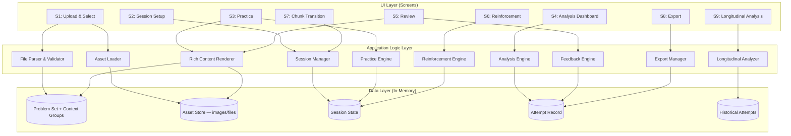
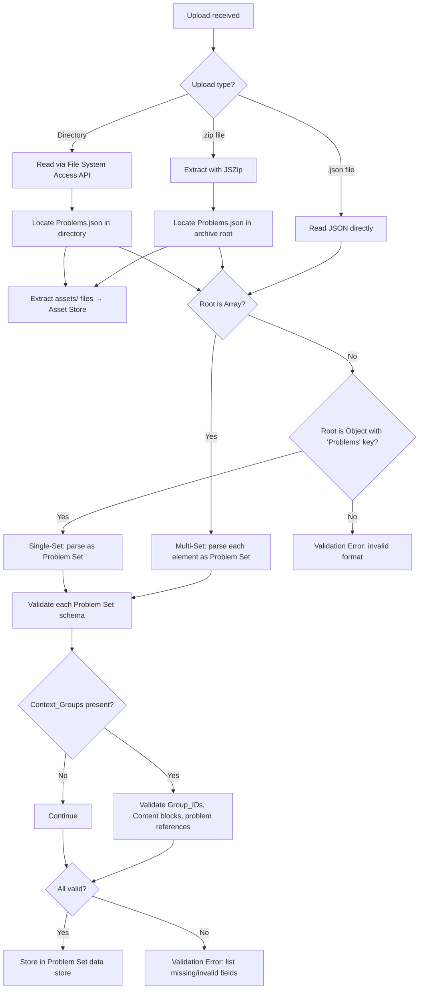
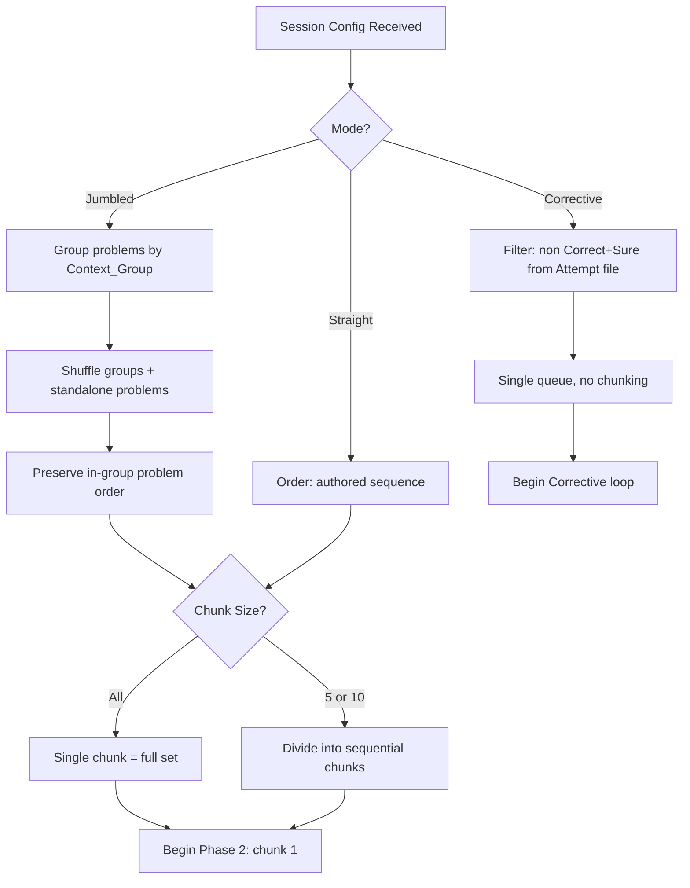
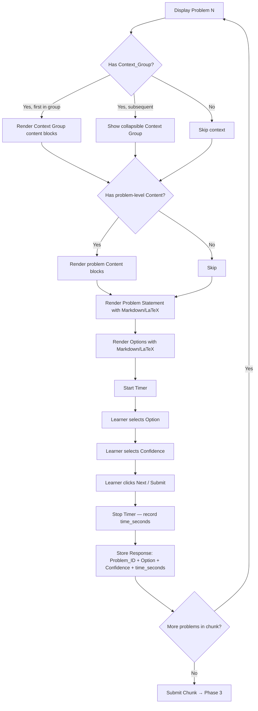
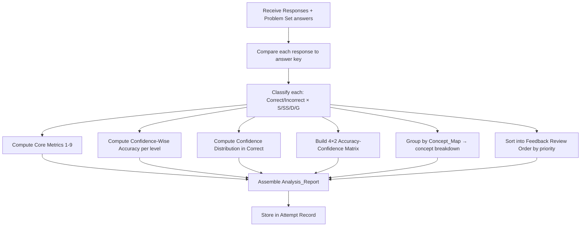
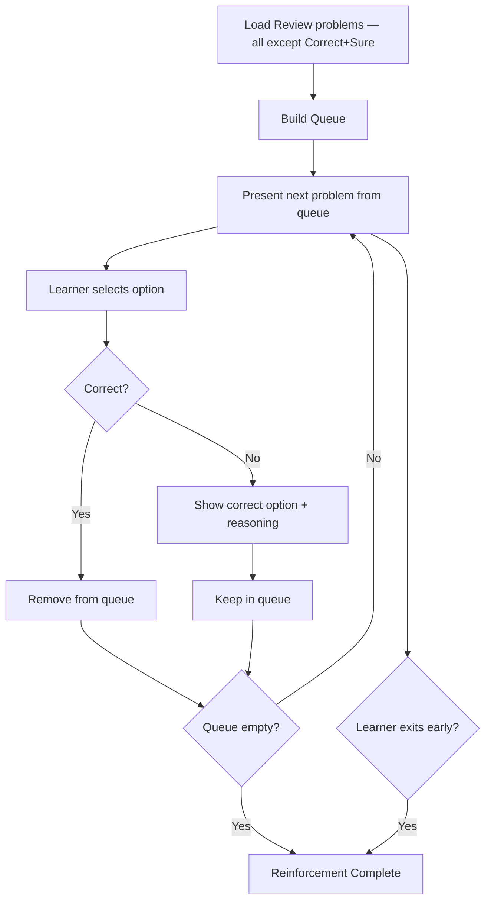

# MCQ Tool — System Architecture Overview

> Derived from: Functional Requirements (FR-1 to FR-10), Data Model (DM-0 to DM-5), UI Screens (UI-1 to UI-10), Non-Functional Requirements (NFR-1 to NFR-6)

---

## 1. Architecture Style

**Single-Page Application (SPA) — Client-Side Only**

Per NFR-1, the entire application runs in the browser with zero server dependency. All processing — file parsing, validation, session management, analysis computation, and export — happens client-side.

```
┌─────────────────────────────────────────────────────────────────┐
│                         BROWSER                                  │
│                                                                  │
│  ┌────────────┐  ┌────────────────┐  ┌───────────────────────┐  │
│  │  UI Layer  │→ │ Application    │→ │  Data / File          │  │
│  │  (Screens) │← │ Logic Layer    │← │  Layer                │  │
│  └────────────┘  └────────────────┘  └───────────────────────┘  │
│                                                                  │
│  Client-side libraries: KaTeX, Marked, JSZip                     │
│  No server. No database. No authentication.                      │
└─────────────────────────────────────────────────────────────────┘
         ↕                                       ↕
    User Input                      JSON / ZIP / Directory (upload/download)
```

---

## 2. High-Level Component Diagram



---

## 3. Layer Responsibilities

### 3.1 UI Layer
Responsible for rendering screens and capturing user input. No business logic.

| Screen | Component | Drives |
|--------|-----------|--------|
| S1 | Upload & Select | File Parser & Validator |
| S2 | Session Setup | Session Manager |
| S3 | Practice | Practice Engine |
| S4 | Analysis Dashboard | Analysis Engine |
| S5 | Review | Feedback Engine |
| S6 | Reinforcement | Reinforcement Engine |
| S7 | Chunk Transition | Session Manager |
| S8 | Export | Export Manager |
| S9 | Longitudinal Analysis | Longitudinal Analyzer |

### 3.2 Application Logic Layer
Contains all business rules. Stateless functions that operate on data.

| Component | Responsibility | Key Requirements |
|-----------|---------------|-----------------|
| **File Parser & Validator** | Parse uploaded JSON/ZIP/directory, detect single/multi-set format, validate schema including Context_Groups and Content blocks | FR-1.1 to FR-1.7 |
| **Asset Loader** | Extract and store images/files from ZIP archives or directory uploads; resolve asset paths relative to Problems.json | FR-1.2, FR-10.3 |
| **Session Manager** | Manage session lifecycle: mode, chunk division, context group–aware shuffling, phase transitions, chunk continuation | FR-3.1 to FR-3.3, FR-5.1 to FR-5.2, FR-2.2 |
| **Practice Engine** | Serve problems in mode order, collect responses (option + confidence + time), handle Corrective mode re-queue logic | FR-2.1 to FR-2.4, FR-4.1 to FR-4.7 |
| **Analysis Engine** | Compute all statistics: core metrics, confidence-wise accuracy, matrix, concept breakdown, feedback review order | FR-7.1 to FR-7.6 |
| **Feedback Engine** | Sort problems into priority-ordered review categories, serve review cards | FR-6.1 to FR-6.3 |
| **Reinforcement Engine** | Manage re-attempt queue, track cleared/remaining problems, enforce stats isolation | FR-6.4 to FR-6.9 |
| **Rich Content Renderer** | Render Content block arrays (text, markdown, latex, image, code); render inline Markdown + LaTeX in Problem_Statement, Options, Explanation | FR-10.1 to FR-10.5 |
| **Export Manager** | Serialize Attempt Record to JSON, generate filename, trigger download | FR-8.1 to FR-8.3 |
| **Longitudinal Analyzer** | Load multiple Attempt files, compute cross-attempt trends | FR-9.1 to FR-9.3 |

### 3.3 Data Layer (In-Memory State)
All data lives in memory during a session. No persistence beyond explicit file export.

| Store | Contents | Lifecycle |
|-------|----------|-----------|
| **Problem Set** | Parsed problem set (problems, metadata, concepts, context groups) | Loaded on upload, read-only during session |
| **Asset Store** | Extracted images/files from ZIP or directory (as Blob URLs) | Loaded with problem set, read-only, revoked on session end |
| **Session State** | Current mode, chunk config, current chunk index, problem queue, per-problem timer state | Created at session start, mutated during practice |
| **Attempt Record** | Responses array + Analysis Report | Built during practice, finalized on submission, exported as JSON |
| **Historical Attempts** | Multiple loaded Attempt Records for longitudinal analysis | Loaded on-demand in S9 |

---

## 4. Component Interaction Detail

### 4.1 File Parser & Validator



### 4.2 Session Manager



### 4.3 Practice Engine



### 4.4 Analysis Engine



### 4.5 Reinforcement Engine



Note: Reinforcement responses do **NOT** flow back to Analysis Engine (FR-6.9).

---

## 5. Technology Constraints

Per NFR requirements:

| Constraint | Detail |
|-----------|--------|
| Runtime | Browser-only, no server |
| Storage | In-memory + JSON file I/O (FileReader API for upload, Blob/URL for download) |
| Persistence | None — learner must export to retain data |
| Auth | None |
| Offline | Fully functional after initial page load |
| Browsers | Chrome, Firefox, Safari, Edge (latest 2 versions) |
| Responsive | Desktop + Tablet |
