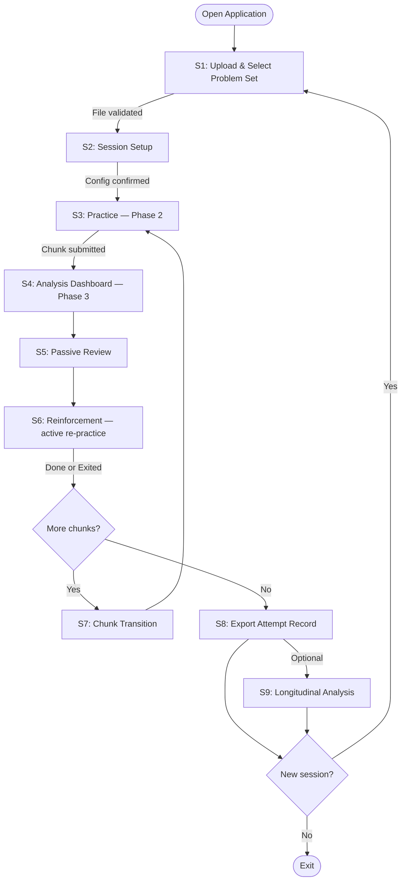
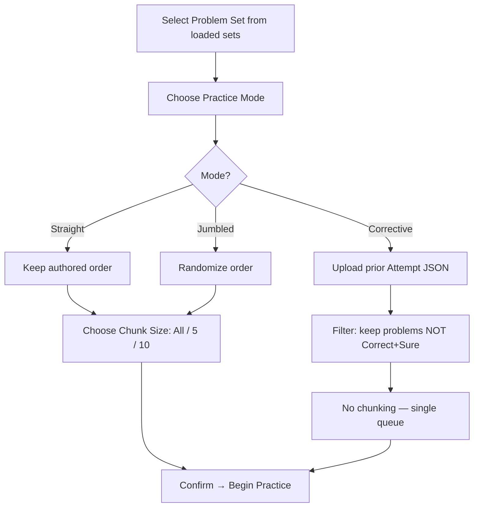
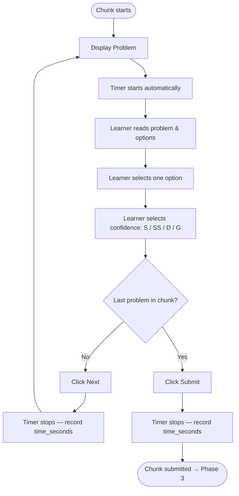
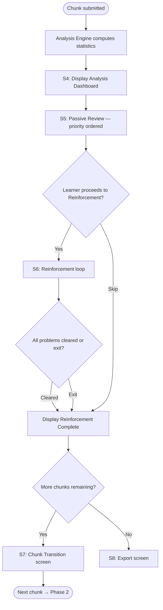
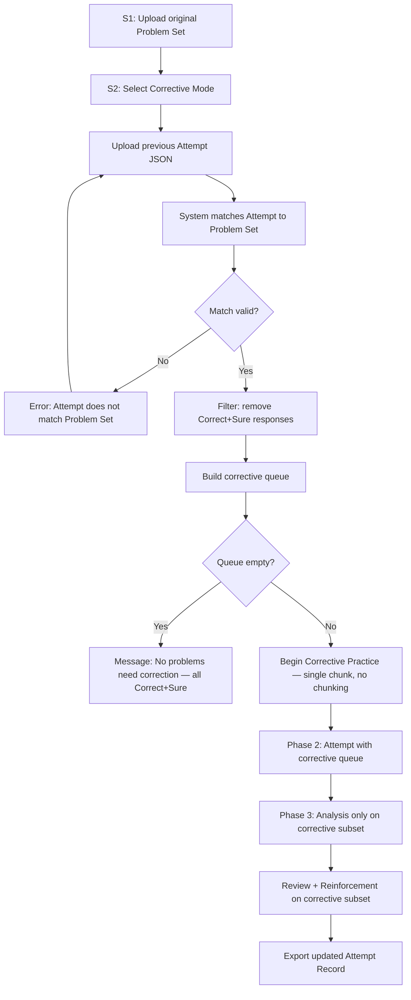
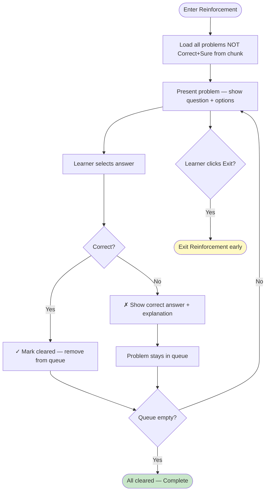
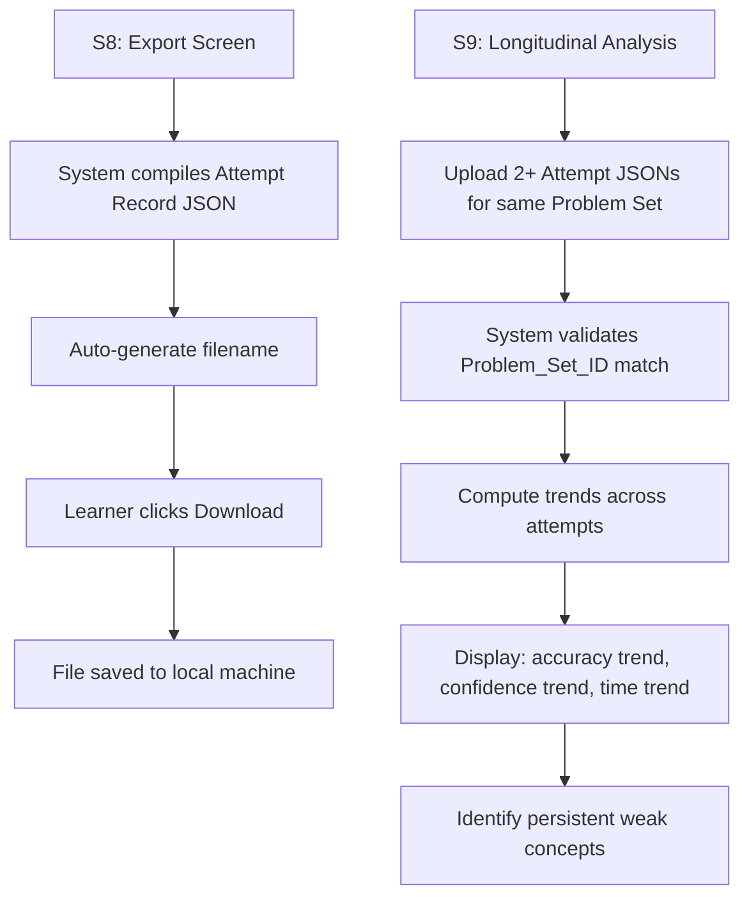
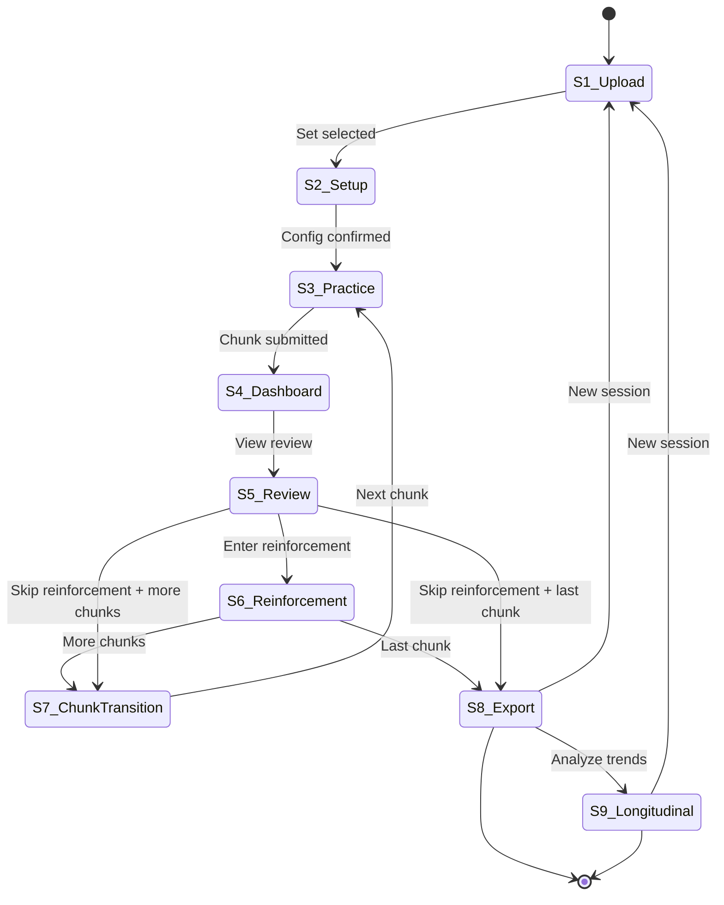

# MCQ Tool — User Flow Diagrams

> Derived from: UI Screens (S1–S9), Functional Requirements (FR-1 to FR-9)

---

## 1. Master Application Flow

---

## 2. Phase-Level Flow (Per Chunk)

### Phase 1: Setup

### Phase 2: Attempt (per chunk)

### Phase 3: Post-Attempt (per chunk)

---

## 3. Corrective Mode Flow

---

## 4. Reinforcement Session Detail

> **Critical Rule**: Reinforcement responses are NOT written back to the Analysis Report. The original attempt statistics remain unchanged (FR-6.9).

---

## 5. Export & Longitudinal Flow

---

## 6. Screen Navigation Map

