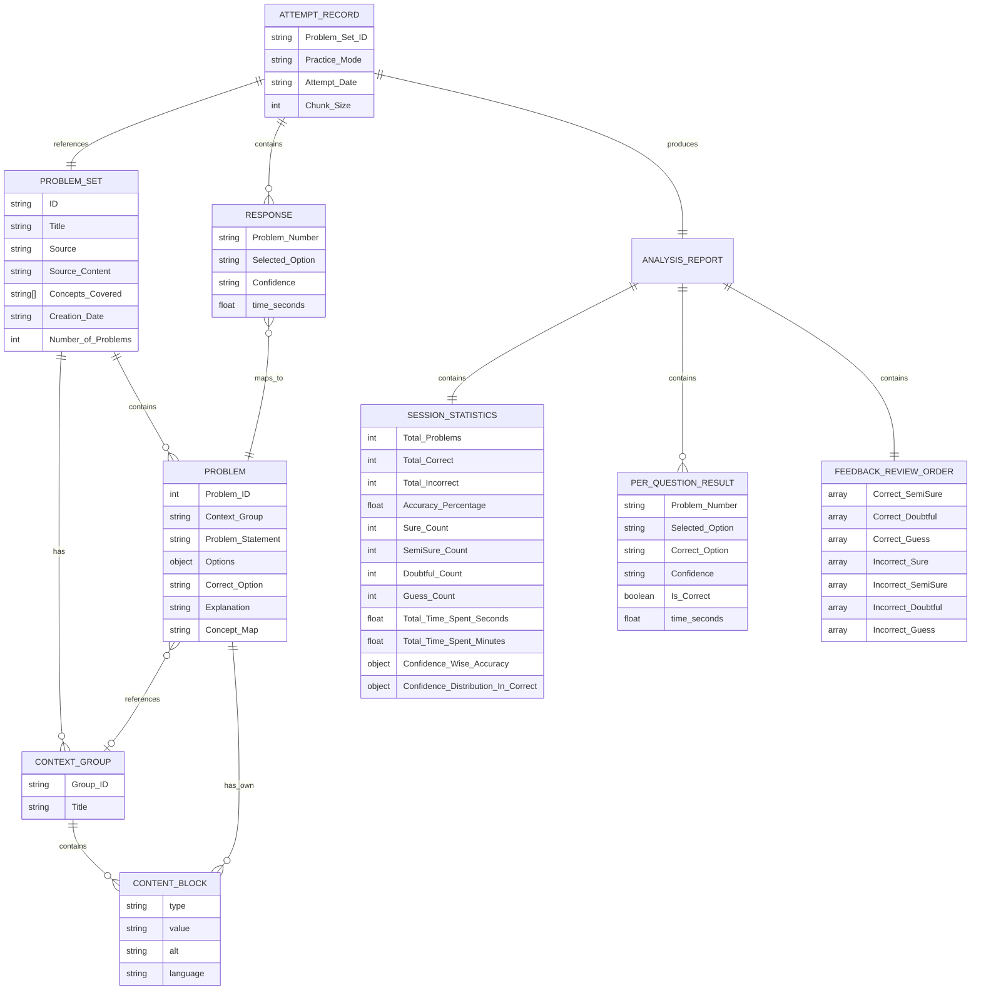
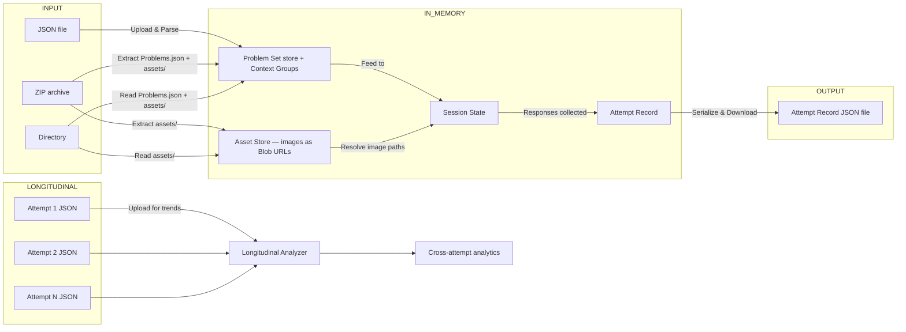
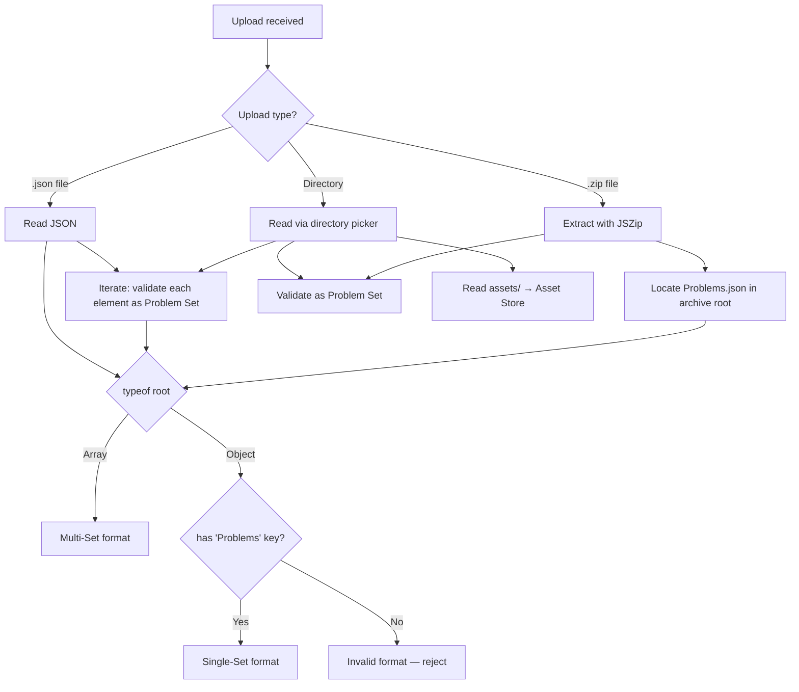

# MCQ Tool — Data Model & Entity Relationship Diagram

> Derived from: Data Model Requirements (DM-0 to DM-5), Sample JSON files, `1_Idea/3_Context_Groups_Rich_Content.md`

---

## 1. Entity Relationship Diagram



---

## 2. Entity Descriptions

### 2.1 Problem Set (Input Data)

The core content entity. Loaded from JSON/ZIP/directory at session start. Immutable during session.

| Field | Type | Description |
|-------|------|-------------|
| ID | String | Unique identifier (e.g., "DV001") |
| Title | String | Human-readable title |
| Source | String | Origin of the problems |
| Source_Content | String | Chapter/topic/reference |
| Concepts_Covered | String[] | List of concept labels |
| Creation_Date | String | ISO date |
| Number_of_Problems | Integer | Count of problems (informational) |
| Context_Groups | ContextGroup[] | Shared context blocks referenced by problems |
| Problems | Problem[] | Array of Problem entities |

### 2.2 Context Group

Shared rich content displayed above a chain of related problems.

| Field | Type | Description |
|-------|------|-------------|
| Group_ID | String | Unique within the set (e.g., "CG1") |
| Title | String | Human-readable label |
| Content | ContentBlock[] | Ordered array of rich content blocks |

### 2.3 Content Block

A typed unit of rich content used in Context Groups and problem-level Content arrays.

| Field | Type | Description |
|-------|------|-------------|
| type | String | One of: `text`, `markdown`, `latex`, `image`, `code` |
| value | String | The content payload |
| alt | String | Alt text (for `image` type, optional) |
| language | String | Programming language (for `code` type, optional) |

### 2.4 Problem

Individual question within a Problem Set.

| Field | Type | Description |
|-------|------|-------------|
| Problem_ID | Integer | Unique within the set |
| Context_Group | String \| null | References Context_Group.Group_ID (null = standalone) |
| Concept_Map | String | Concept this problem tests |
| Content | ContentBlock[] | Problem-specific rich content (optional) |
| Problem_Statement | String | Question text (supports Markdown + inline LaTeX) |
| Options | Object | Key-value pairs: {"A": "...", ...} (values support Markdown + inline LaTeX) |
| Correct_Option | String | Key of the correct option |
| Explanation | String | Reasoning (supports Markdown + inline LaTeX) |

### 2.5 Attempt Record (Output Data)

Generated during a practice session. Contains all responses and computed analytics.

| Field | Type | Description |
|-------|------|-------------|
| Problem_Set_ID | String | References the attempted Problem Set |
| Practice_Mode | String | "Straight" / "Jumbled" / "Corrective" |
| Attempt_Date | String | ISO date-time |
| Chunk_Size | Integer | "All" / 5 / 10 |
| Responses | Response[] | Array of per-problem responses |
| Analysis_Report | Object | Computed statistics and feedback |

### 2.6 Response

Per-problem attempt record.

| Field | Type | Description |
|-------|------|-------------|
| Problem_ID | Integer | References Problem.Problem_ID |
| Selected_Option | String | Learner's chosen option key |
| Confidence | String | One of: "Sure", "SemiSure", "Doubtful", "Guess" |
| time_seconds | Float | Seconds spent on this problem |

### 2.7 Confidence Enum

```
Confidence ∈ { "Sure", "SemiSure", "Doubtful", "Guess" }
```

Abbreviations used in submission: S, SS, D, G.

---

## 3. Analysis Report Structure

### 3.1 Session Statistics

| Metric | Type | Derivation |
|--------|------|-----------|
| Total_Problems | int | Count of responses |
| Total_Correct | int | Count where Selected_Option == Correct_Option |
| Total_Incorrect | int | Total_Problems − Total_Correct |
| Accuracy_Percentage | float | (Total_Correct / Total_Problems) × 100 |
| Sure_Count | int | Count where Confidence == "Sure" |
| SemiSure_Count | int | Count where Confidence == "SemiSure" |
| Doubtful_Count | int | Count where Confidence == "Doubtful" |
| Guess_Count | int | Count where Confidence == "Guess" |
| Total_Time_Spent_Seconds | float | Sum of all time_seconds |
| Total_Time_Spent_Minutes | float | Total_Time_Spent_Seconds / 60 |

### 3.2 Confidence-Wise Accuracy

Accuracy computed per confidence level:

```
Confidence_Wise_Accuracy = {
    "Sure":     { Correct: n, Incorrect: m, Accuracy: % },
    "SemiSure": { Correct: n, Incorrect: m, Accuracy: % },
    "Doubtful": { Correct: n, Incorrect: m, Accuracy: % },
    "Guess":    { Correct: n, Incorrect: m, Accuracy: % }
}
```

### 3.3 Confidence Distribution in Correct Answers

Among all correct answers, the distribution of confidence levels:

```
Confidence_Distribution_In_Correct = {
    "Sure":     { Count: n, Percentage: % },
    "SemiSure": { Count: n, Percentage: % },
    "Doubtful": { Count: n, Percentage: % },
    "Guess":    { Count: n, Percentage: % }
}
```

### 3.4 Feedback Review Order

7 priority categories (Correct+Sure is excluded):

| Priority | Category | Meaning |
|----------|----------|---------|
| 1 | Correct + SemiSure | Incomplete grip |
| 2 | Correct + Doubtful | Lucky or partial reasoning |
| 3 | Correct + Guess | No real understanding |
| 4 | Incorrect + Sure | Dangerous blind spot |
| 5 | Incorrect + SemiSure | Near-miss confusion |
| 6 | Incorrect + Doubtful | Expected knowledge gap |
| 7 | Incorrect + Guess | Expected knowledge gap |

---

## 4. Data Lifecycle



### 4.1 Lifecycle Rules

1. **Problem Set** — Loaded once (from JSON, ZIP, or directory), read-only throughout session
2. **Asset Store** — Images/files extracted from ZIP or directory as Blob URLs, read-only, revoked on session end
3. **Session State** — Created at setup, mutated during practice, discarded on session end
4. **Attempt Record** — Built incrementally during practice, finalized on submission, immutable after finalization
5. **Historical Attempts** — Loaded on-demand in longitudinal screen, read-only
6. **No implicit persistence** — All data lost on page close unless explicitly exported

---

## 5. Format Detection Logic



Single Set: root is an object with `ID`, `Title`, `Problems[]`, etc.
Multi Set: root is an array where each element is a valid Problem Set object.
