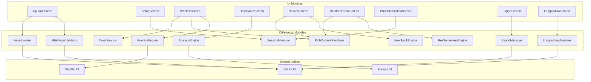
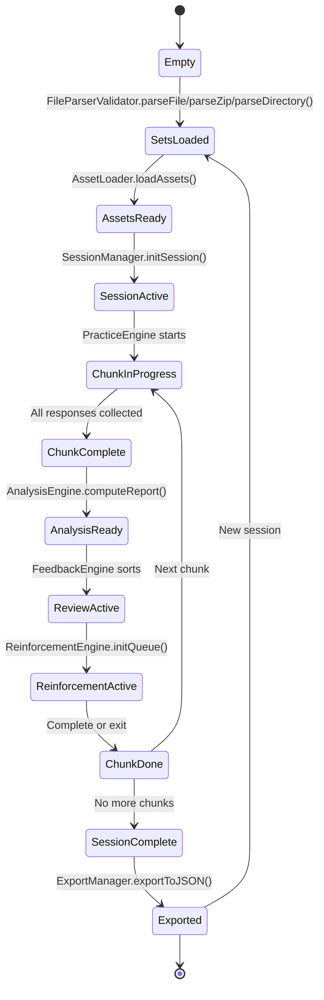

# MCQ Tool — Component Architecture & Module Decomposition

> Derived from: System Architecture (§2–§3), Functional Requirements (FR-1 to FR-10), UI Screens (S1–S9)

---

## 1. Module Decomposition Diagram



---

## 2. Module Interface Specifications

### 2.1 FileParserValidator

Parses and validates uploaded JSON files, ZIP archives, or directories.

```
Inputs:
  - rawFile: File (from file input — .json or .zip)
  - directoryHandle: FileSystemDirectoryHandle (from directory picker)

Outputs:
  - problemSets: ProblemSet[]   (one or more validated sets)
  - assetFiles: Map<string, Blob>  (extracted assets keyed by relative path)
  - errors: ValidationError[]   (list of issues if invalid)

Methods:
  parseFile(file) → { sets: ProblemSet[], assets: Map<string, Blob>, errors: string[] }
  parseZip(file) → { sets: ProblemSet[], assets: Map<string, Blob>, errors: string[] }
  parseDirectory(dirHandle) → { sets: ProblemSet[], assets: Map<string, Blob>, errors: string[] }
  detectFormat(json) → "single" | "multi" | "invalid"
  validateProblemSet(obj) → { valid: boolean, errors: string[] }
  validateContextGroups(groups, problems) → { valid: boolean, errors: string[] }
  validateContentBlocks(blocks) → { valid: boolean, errors: string[] }
```

### 2.2 AssetLoader

Manages loading and resolving image/file assets from uploads.

```
Inputs:
  - assetFiles: Map<string, Blob>  (from FileParserValidator)

State:
  - blobURLs: Map<string, string>  (relative path → Blob URL)

Methods:
  loadAssets(assetFiles) → void  (creates Blob URLs in memory)
  resolveURL(relativePath) → string | null  (returns Blob URL for a path)
  isDataURI(value) → boolean
  revokeAll() → void  (cleanup Blob URLs on session end)
```

### 2.3 SessionManager

Manages session lifecycle: mode selection, chunk division, context group–aware shuffling, phase transitions.

```
Inputs:
  - problemSet: ProblemSet
  - mode: "Straight" | "Jumbled" | "Corrective"
  - chunkSize: "All" | 5 | 10
  - priorAttempt?: AttemptRecord  (for Corrective mode)

State:
  - chunks: Problem[][]
  - currentChunkIndex: number
  - currentPhase: 1 | 2 | 3

Methods:
  initSession(config) → SessionState
  groupByContext(problems, contextGroups) → ProblemGroup[]  (groups + standalone)
  shuffleGroups(groups) → Problem[]  (shuffle groups, preserve in-group order)
  getCurrentChunk() → Problem[]
  advanceToNextChunk() → Problem[] | null
  hasMoreChunks() → boolean
  getPhase() → 1 | 2 | 3
  setPhase(phase) → void
```

### 2.4 PracticeEngine

Serves problems and collects responses during Phase 2. Delegates rendering of rich content.

```
Inputs:
  - problems: Problem[]  (the current chunk)
  - contextGroups: ContextGroup[]  (from problem set)
  - mode: PracticeMode

State:
  - currentIndex: number
  - responses: Response[]
  - lastContextGroupID: string | null  (tracks which group was last shown)

Methods:
  getCurrentProblem() → Problem
  getContextForProblem(problem) → { group: ContextGroup | null, isFirst: boolean }
  submitResponse(option, confidence, timeSeconds) → void
  nextProblem() → Problem | null
  isLastProblem() → boolean
  getResponses() → Response[]
  reset() → void
```

### 2.5 TimerService

Tracks time per problem.

```
State:
  - startTime: timestamp | null
  - elapsed: number

Methods:
  start() → void
  stop() → number  (returns elapsed seconds)
  reset() → void
```

### 2.6 AnalysisEngine

Computes all statistics from responses. Pure functions, no side effects.

```
Inputs:
  - responses: Response[]
  - problems: Problem[]  (for answer keys and concept mapping)

Outputs:
  - analysisReport: AnalysisReport

Methods:
  computeReport(responses, problems) → AnalysisReport
  computeCoreMetrics(responses, problems) → SessionStatistics
  computeConfidenceWiseAccuracy(responses, problems) → ConfidenceWiseAccuracy
  computeConfidenceDistributionInCorrect(responses, problems) → ConfidenceDistribution
  computeAccuracyConfidenceMatrix(responses, problems) → Matrix4x2
  computeConceptBreakdown(responses, problems) → ConceptBreakdown[]
  buildFeedbackReviewOrder(perQuestionResults) → FeedbackReviewOrder
```

### 2.7 FeedbackEngine

Sorts problems into priority-ordered review categories for passive review.

```
Inputs:
  - perQuestionResults: PerQuestionResult[]

Outputs:
  - orderedReviewList: PerQuestionResult[]  (priority-sorted)

Methods:
  getReviewOrder(results) → PerQuestionResult[]
  getCategoryProblems(category) → PerQuestionResult[]
```

Priority: Correct+SS → Correct+D → Correct+G → Incorrect+S → Incorrect+SS → Incorrect+D → Incorrect+G

### 2.8 ReinforcementEngine

Manages the active re-practice loop. Responses here are ephemeral.

```
Inputs:
  - problems: Problem[]  (non Correct+Sure subset)
  - perQuestionResults: PerQuestionResult[]

State:
  - queue: Problem[]
  - clearedCount: number

Methods:
  initQueue(perQuestionResults, problems) → void
  getCurrentProblem() → Problem | null
  submitAnswer(option) → { correct: boolean, correctOption: string, explanation: string }
  getProgress() → { cleared: number, remaining: number, total: number }
  isComplete() → boolean
```

### 2.9 ExportManager

Serializes the Attempt Record to JSON and triggers a file download.

```
Inputs:
  - attemptRecord: AttemptRecord

Methods:
  generateFilename(attemptRecord) → string
  exportToJSON(attemptRecord) → void  (triggers browser download)
```

### 2.10 LongitudinalAnalyzer

Compares multiple Attempt Records across sessions.

```
Inputs:
  - attempts: AttemptRecord[]  (2+ records for same Problem_Set_ID)

Outputs:
  - trends: LongitudinalReport

Methods:
  validateSameSet(attempts) → boolean
  computeAccuracyTrend(attempts) → number[]
  computeConfidenceTrend(attempts) → object[]
  computeTimeTrend(attempts) → number[]
  identifyPersistentWeakConcepts(attempts) → string[]
```

### 2.11 RichContentRenderer

Renders Content block arrays and inline Markdown + LaTeX in text fields.

```
Inputs:
  - contentBlocks: ContentBlock[]  (from Context Group or Problem)
  - text: string  (inline text field — Problem_Statement, option, explanation)
  - assetLoader: AssetLoader  (for resolving image paths)

Dependencies:
  - Marked (or equivalent) — Markdown → HTML
  - KaTeX — LaTeX rendering
  - AssetLoader — image path resolution

Methods:
  renderContentBlocks(blocks, assetLoader) → HTMLElement  (renders array of typed blocks)
  renderInlineRichText(text) → string  (Markdown + inline LaTeX → HTML)
  renderLatexBlock(latex) → HTMLElement  (display-mode $$...$$)
  renderCodeBlock(code, language?) → HTMLElement  (syntax-highlighted <pre>)
  renderImage(src, alt?, assetLoader) → HTMLElement  (resolve path, create )
```

### 2.12 Shared Utilities

```
ShuffleUtil:
  shuffle(array) → array  (Fisher-Yates)
  shuffleGroups(groups) → array  (shuffle groups, preserve in-group order)

FileIOUtil:
  readJSONFile(file) → Promise<object>  (FileReader API)
  readZipFile(file) → Promise<{ json: object, assets: Map<string, Blob> }>  (JSZip)
  readDirectory(dirHandle) → Promise<{ json: object, assets: Map<string, Blob> }>  (File System Access API)
  downloadJSON(data, filename) → void   (Blob + URL.createObjectURL)

FormatUtil:
  formatPercentage(value) → string
  formatTime(seconds) → string
```

---

## 3. Module Dependency Matrix

| Module | Depends On |
|--------|-----------|
| UploadScreen | FileParserValidator, AssetLoader |
| SetupScreen | SessionManager |
| PracticeScreen | PracticeEngine, TimerService, RichContentRenderer |
| DashboardScreen | AnalysisEngine |
| ReviewScreen | FeedbackEngine, RichContentRenderer |
| ReinforcementScreen | ReinforcementEngine, RichContentRenderer |
| ChunkTransitionScreen | SessionManager |
| ExportScreen | ExportManager |
| LongitudinalScreen | LongitudinalAnalyzer |
| FileParserValidator | FileIOUtil |
| AssetLoader | FileIOUtil |
| PracticeEngine | ShuffleUtil |
| SessionManager | ShuffleUtil |
| AnalysisEngine | FormatUtil |
| RichContentRenderer | AssetLoader, Marked (lib), KaTeX (lib) |
| ExportManager | FileIOUtil |
| LongitudinalAnalyzer | FileIOUtil |

---

## 4. Data Flow Between Modules

```mermaid
flowchart LR
    FPV[FileParserValidator] -->|ProblemSet + assets| ASL[AssetLoader]
    FPV -->|ProblemSet| SMG[SessionManager]
    ASL -->|Blob URLs| RCR[RichContentRenderer]
    SMG -->|Problem[] chunk| PEN[PracticeEngine]
    PEN -->|Problem + Context| RCR
    PEN -->|Response[]| AEN[AnalysisEngine]
    AEN -->|AnalysisReport| FEN[FeedbackEngine]
    AEN -->|PerQuestionResult[]| REN[ReinforcementEngine]
    AEN -->|AttemptRecord| EXM[ExportManager]
    EXM -->|JSON file| LAN[LongitudinalAnalyzer]

    TMR[TimerService] -->|time_seconds| PEN
```

---

## 5. State Management Overview



---

## 6. Critical Design Rules

| Rule | Enforced By | Reference |
|------|------------|-----------|
| Reinforcement responses do NOT affect Analysis Report | ReinforcementEngine (ephemeral state, no write-back to AttemptRecord) | FR-6.9 |
| Corrective mode excludes Correct+Sure problems | SessionManager.initSession() filters prior attempt | FR-2.4 |
| Timer captures per-problem time, not cumulative | TimerService resets per problem | FR-4.6, FR-4.7 |
| Problem Set is immutable during session | FileParserValidator returns frozen copy | FR-1.1 |
| Analysis only runs on original attempt data per chunk | AnalysisEngine receives only PracticeEngine responses | FR-7.1 |
| Context group problems stay together in Jumbled mode | SessionManager.shuffleGroups() shuffles groups not individual problems | FR-2.2 |
| Asset Blob URLs are revoked on session end | AssetLoader.revokeAll() called on session teardown | NFR-2 |
| Context Groups and Content blocks are optional | FileParserValidator treats absent fields as defaults (null/empty) | FR-10, DM-1.3 |
| Rich content rendered via Marked + KaTeX | RichContentRenderer handles all Markdown/LaTeX/image rendering | FR-10.1, FR-10.2 |
