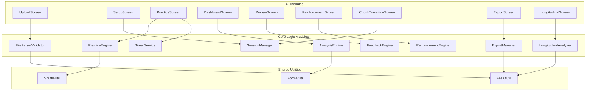
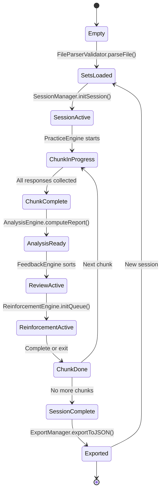

# MCQ Tool — Component Architecture & Module Decomposition

> Derived from: System Architecture (§2–§3), Functional Requirements (FR-1 to FR-9), UI Screens (S1–S9)

---

## 1. Module Decomposition Diagram



---

## 2. Module Interface Specifications

### 2.1 FileParserValidator

Parses and validates uploaded JSON files.

```
Inputs:
  - rawFile: File (from file input)

Outputs:
  - problemSets: ProblemSet[]   (one or more validated sets)
  - errors: ValidationError[]   (list of issues if invalid)

Methods:
  parseFile(file) → { sets: ProblemSet[], errors: string[] }
  detectFormat(json) → "single" | "multi" | "invalid"
  validateProblemSet(obj) → { valid: boolean, errors: string[] }
```

### 2.2 SessionManager

Manages session lifecycle: mode selection, chunk division, phase transitions.

```
Inputs:
  - problemSet: ProblemSet
  - mode: "Straight" | "Jumbled" | "Corrective"
  - chunkSize: "All" | 5 | 10
  - priorAttempt?: AttemptRecord  (for Corrective mode)

State:
  - chunks: Problem[][]
  - currentChunkIndex: number
  - currentPhase: 1 | 2 | 3

Methods:
  initSession(config) → SessionState
  getCurrentChunk() → Problem[]
  advanceToNextChunk() → Problem[] | null
  hasMoreChunks() → boolean
  getPhase() → 1 | 2 | 3
  setPhase(phase) → void
```

### 2.3 PracticeEngine

Serves problems and collects responses during Phase 2.

```
Inputs:
  - problems: Problem[]  (the current chunk)
  - mode: PracticeMode

State:
  - currentIndex: number
  - responses: Response[]

Methods:
  getCurrentProblem() → Problem
  submitResponse(option, confidence, timeSeconds) → void
  nextProblem() → Problem | null
  isLastProblem() → boolean
  getResponses() → Response[]
  reset() → void
```

### 2.4 TimerService

Tracks time per problem.

```
State:
  - startTime: timestamp | null
  - elapsed: number

Methods:
  start() → void
  stop() → number  (returns elapsed seconds)
  reset() → void
```

### 2.5 AnalysisEngine

Computes all statistics from responses. Pure functions, no side effects.

```
Inputs:
  - responses: Response[]
  - problems: Problem[]  (for answer keys and concept mapping)

Outputs:
  - analysisReport: AnalysisReport

Methods:
  computeReport(responses, problems) → AnalysisReport
  computeCoreMetrics(responses, problems) → SessionStatistics
  computeConfidenceWiseAccuracy(responses, problems) → ConfidenceWiseAccuracy
  computeConfidenceDistributionInCorrect(responses, problems) → ConfidenceDistribution
  computeAccuracyConfidenceMatrix(responses, problems) → Matrix4x2
  computeConceptBreakdown(responses, problems) → ConceptBreakdown[]
  buildFeedbackReviewOrder(perQuestionResults) → FeedbackReviewOrder
```

### 2.6 FeedbackEngine

Sorts problems into priority-ordered review categories for passive review.

```
Inputs:
  - perQuestionResults: PerQuestionResult[]

Outputs:
  - orderedReviewList: PerQuestionResult[]  (priority-sorted)

Methods:
  getReviewOrder(results) → PerQuestionResult[]
  getCategoryProblems(category) → PerQuestionResult[]
```

Priority: Correct+SS → Correct+D → Correct+G → Incorrect+S → Incorrect+SS → Incorrect+D → Incorrect+G

### 2.7 ReinforcementEngine

Manages the active re-practice loop. Responses here are ephemeral.

```
Inputs:
  - problems: Problem[]  (non Correct+Sure subset)
  - perQuestionResults: PerQuestionResult[]

State:
  - queue: Problem[]
  - clearedCount: number

Methods:
  initQueue(perQuestionResults, problems) → void
  getCurrentProblem() → Problem | null
  submitAnswer(option) → { correct: boolean, correctOption: string, explanation: string }
  getProgress() → { cleared: number, remaining: number, total: number }
  isComplete() → boolean
```

### 2.8 ExportManager

Serializes the Attempt Record to JSON and triggers a file download.

```
Inputs:
  - attemptRecord: AttemptRecord

Methods:
  generateFilename(attemptRecord) → string
  exportToJSON(attemptRecord) → void  (triggers browser download)
```

### 2.9 LongitudinalAnalyzer

Compares multiple Attempt Records across sessions.

```
Inputs:
  - attempts: AttemptRecord[]  (2+ records for same Problem_Set_ID)

Outputs:
  - trends: LongitudinalReport

Methods:
  validateSameSet(attempts) → boolean
  computeAccuracyTrend(attempts) → number[]
  computeConfidenceTrend(attempts) → object[]
  computeTimeTrend(attempts) → number[]
  identifyPersistentWeakConcepts(attempts) → string[]
```

### 2.10 Shared Utilities

```
ShuffleUtil:
  shuffle(array) → array  (Fisher-Yates)

FileIOUtil:
  readJSONFile(file) → Promise<object>  (FileReader API)
  downloadJSON(data, filename) → void   (Blob + URL.createObjectURL)

FormatUtil:
  formatPercentage(value) → string
  formatTime(seconds) → string
```

---

## 3. Module Dependency Matrix

| Module | Depends On |
|--------|-----------|
| UploadScreen | FileParserValidator |
| SetupScreen | SessionManager |
| PracticeScreen | PracticeEngine, TimerService |
| DashboardScreen | AnalysisEngine |
| ReviewScreen | FeedbackEngine |
| ReinforcementScreen | ReinforcementEngine |
| ChunkTransitionScreen | SessionManager |
| ExportScreen | ExportManager |
| LongitudinalScreen | LongitudinalAnalyzer |
| FileParserValidator | FileIOUtil |
| PracticeEngine | ShuffleUtil |
| AnalysisEngine | FormatUtil |
| ExportManager | FileIOUtil |
| LongitudinalAnalyzer | FileIOUtil |

---

## 4. Data Flow Between Modules

```mermaid
flowchart LR
    FPV[FileParserValidator] -->|ProblemSet| SMG[SessionManager]
    SMG -->|Problem[] chunk| PEN[PracticeEngine]
    PEN -->|Response[]| AEN[AnalysisEngine]
    AEN -->|AnalysisReport| FEN[FeedbackEngine]
    AEN -->|PerQuestionResult[]| REN[ReinforcementEngine]
    AEN -->|AttemptRecord| EXM[ExportManager]
    EXM -->|JSON file| LAN[LongitudinalAnalyzer]

    TMR[TimerService] -->|time_seconds| PEN
```

---

## 5. State Management Overview



---

## 6. Critical Design Rules

| Rule | Enforced By | Reference |
|------|------------|-----------|
| Reinforcement responses do NOT affect Analysis Report | ReinforcementEngine (ephemeral state, no write-back to AttemptRecord) | FR-6.9 |
| Corrective mode excludes Correct+Sure problems | SessionManager.initSession() filters prior attempt | FR-2.4 |
| Timer captures per-problem time, not cumulative | TimerService resets per problem | FR-4.6, FR-4.7 |
| Problem Set is immutable during session | FileParserValidator returns frozen copy | FR-1.1 |
| Analysis only runs on original attempt data per chunk | AnalysisEngine receives only PracticeEngine responses | FR-7.1 |
| Chunk order preserved even in Jumbled mode (only within-chunk is shuffled) | SessionManager divides first, PracticeEngine shuffles within | FR-3.2 |
